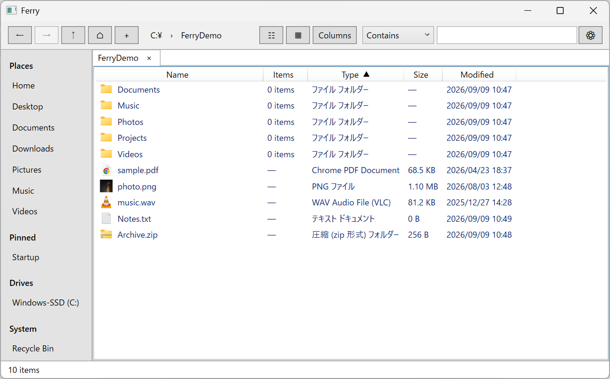

# Ferry

**Nautilusのシンプルさが恋しいWindowsユーザーのための、軽量ファイルマネージャー。**

Ferryは、GNOME Files（Nautilus）の気持ちよいファイル操作体験から着想を得て、Windows 11向けに独立実装したファイルマネージャーです。

LinuxとWindowsを行き来していると、Nautilusの「必要十分で迷わない」操作感が恋しくなることがあります。Ferryは、そのギャップを埋めるために生まれました。

> **現在の正式版:** v1.0.0  
> **対応OS:** Windows 11  
> **Runtime:** .NET Framework 4.8 / WPF  
> **License:** MIT

[English README](README.md)

## ダウンロード

**[Ferry v1.0.0 for Windows をダウンロード（Portable ZIP）](https://github.com/kazu0m1/Ferry/releases/latest/download/Ferry-v1.0.0-win-portable.zip)**

インストールは不要です。ZIPを展開して `Ferry.exe` を実行してください。

> **Windows SmartScreenについて:** Ferryは現在コード署名されていないため、初回起動時にWindowsの警告が表示されることがあります。この公式リポジトリからダウンロードしたFerryであれば、**詳細情報** → **実行** から起動できます。

## スクリーンショット



## Ferryが大切にしていること

FerryはExplorerを丸ごと置き換える巨大なファイルマネージャーを目指していません。日常のファイル操作で価値の高い部分に絞っています。

- **Nautilusに着想を得たシンプルな操作感**
- **フォルダー内アイテム数の表示** — Grid/Listの両方で確認可能
- **高速な再帰ファイル名検索** — 結果を逐次表示
- **強力な一括リネーム** — 置換・連番・開始番号指定・ライブプレビュー
- **タブ** — 必要十分なタブブラウジング
- **Windowsとの自然な統合** — ごみ箱、プロパティ、詳細Shellメニュー、ショートカット、D&D
- **ZIP圧縮・展開** — Windows 11標準機能へ委譲
- **Portable** — 設定は小さなJSON。独自DBもテレメトリもありません

### 小さいけれど、日常で効く工夫：`F12`

ファイルが画面いっぱいに並ぶと、**Open Terminal Here**のために背景を右クリックできる空白がほとんど残らないことがあります。Ferryでは、その小さな不便を避けるため、選択中のアイテムやキーボードフォーカスの位置に関係なく、**`F12`**を押すだけで現在表示しているフォルダーをTerminalで開けます。

派手な機能ではありませんが、余計なUIを増やさず、日常のファイル操作を直接的で予測しやすくするというFerryの考え方を表す機能のひとつです。

## 起動

### A. GitHub ReleasesのPortable版

1. 上の**ダウンロード**リンクから`Ferry-v1.0.0-win-portable.zip`をダウンロードします。
2. 好きなフォルダーへ展開します。
3. `Ferry.exe`を実行します。

設定は`Ferry.exe`と同じ場所にある`config`フォルダーへ保存されます。

### B. Source / self-building版

1. Sourceをダウンロードまたはcloneします。
2. `Portable\Run-Ferry.cmd`を実行します。
3. `Ferry.exe`がなければ、`Build.cmd`を呼び出してWindowsに含まれる.NET Framework C#コンパイラでローカルビルドします。
4. Ferryが起動します。

Visual Studio、NuGet、別途.NET SDK、インターネット接続は不要です。

## 公開版v1.0.0の初期設定

- Sort folders before files: **ON**（SettingsでOFFに変更可能）
- Home: Windowsのユーザープロファイルフォルダー `%USERPROFILE%`
- View: **List**
- Search: **Contains**
- Terminal: **Auto**
- UI: **English**
- Debug logging: **Off**

TerminalのAutoは次の順に起動を試みます。

1. Windows Terminal
2. Windows PowerShell
3. Command Prompt

MSYS2/UCRT64などを使いたい場合は、Settingsで任意のコマンドと引数を設定できます。公開版には特定PC向けの絶対パスを含めていません。

## 主な機能

### ファイル表示・ナビゲーション

- Home / 標準ユーザーフォルダー / ピン留め / ドライブ / ごみ箱のSidebar
- Breadcrumb
- Back / Forward / Up / Home
- Tabs
- List / Grid
- Natural Sort
- Sort folders before files（既定ON）
- 昇順/降順インジケーター
- `Ctrl+Click` / `Shift+Click` / `Ctrl+A`による複数選択
- 複数選択して`Enter`で一括Open
- 選択済みアイテムからD&Dすると選択セット全体をD&D
- 外部から新規追加されたアイテムは末尾に留まり、`F5`やカラムクリックなどユーザーが明示したときに再ソート
- ダウンロード中の`.crdownload`などは位置を動かさずSize/Modifiedを更新
- `F12`で、選択状態に関係なく現在フォルダーにTerminalを開く

> v1.0ではラバーバンド（矩形）範囲選択は実装していません。連続範囲の選択には`Shift+Click`を使用します。

### 検索

- 現在フォルダー以下を再帰検索
- ファイル名・フォルダー名を対象
- 非同期・逐次表示
- Contains / StartsWith
- `*` / `?` ワイルドカード
- Windows Search Indexを利用できる場合は利用し、不足分は直接走査
- Ferry独自の検索DBは作成しない

### リネーム

単一項目の`F2`では拡張子を含む完全ファイル名を表示し、初期選択はファイル名本体だけにします。

複数項目の`F2`では一括リネーム画面を開きます。

- Find & Replace
- 連番テンプレート
- 開始番号指定
- Current → Newのライブプレビュー
- 現在の表示順に従う連番順序
- 衝突安全な2段階リネーム
- 一括リネームでは拡張子を保護

### ごみ箱

Windows管理のごみ箱をFerry内の仮想ビューとして表示します。

- Restore
- Delete Permanently
- Open Original Location
- Empty Recycle Bin

### Windows連携 / ファイル操作

- Copy / Cut / Paste
- Recycle Binへの削除 / 完全削除
- D&D
- Properties
- Open With
- Windows詳細Shellメニュー（複数選択を含む）
- Windowsショートカット
- アイコン / サムネイル

### ZIP

- Compress to ZIP
- Extract Here
- Extract to `<archive-name>\`

Ferry独自の圧縮コーデックは持たず、Windows 11のアーカイブ機能へ委譲します。

## Open with FerryをExplorerへ追加

ビルド後に、

```text
ShellIntegration\Register.cmd
```

を実行すると、現在のWindowsユーザーのフォルダーcontext menuに**Open with Ferry**を追加できます。管理者権限は不要です。

解除は、

```text
ShellIntegration\Unregister.cmd
```

です。Explorerの通常のフォルダーOpenを強制的にFerryへ置き換えることはしません。

## 主なキーボードショートカット

| Shortcut | Action |
|---|---|
| `Ctrl+T` | Homeを新しいタブで開く |
| `Ctrl+W` | タブを閉じる |
| `Ctrl+Tab` | 次のタブ |
| `Ctrl+Shift+Tab` | 前のタブ |
| `Alt+Left` | Back |
| `Alt+Right` | Forward |
| `Alt+Up` | Parent folder |
| `Ctrl+L` | パス入力 |
| `Ctrl+F` | Search |
| `F5` | Refreshして現在の条件で再ソート |
| `F12` | 現在フォルダーでOpen Terminal Here |
| `F2` | Rename / bulk rename |
| `Ctrl+C/X/V` | Copy / Cut / Paste |
| `Ctrl+A` | 全選択 |
| `Delete` | ごみ箱へ移動 |
| `Shift+Delete` | 完全削除 |
| `Enter` | 選択中の全アイテムをOpen |
| `Alt+Enter` | Properties |
| `Esc` | Search終了 / 選択解除 |
| `Shift+Right-click` | Windows詳細context menu |

## 設定とプライバシー

設定はSource/self-building構成では`Portable\config\settings.json`、Binary Portable版では`Ferry.exe`と同じ場所の`config\settings.json`に保存します。

`settings.json`が存在しない、またはJSONが壊れている場合でもFerryはfactory defaultで起動します。SettingsをSaveすれば正常なJSONが生成されます。

Ferryには次のものがありません。

- テレメトリ
- 自動クラッシュ送信
- アカウント
- 常駐サービス
- 独自検索DB
- 独自クラウド同期

Windowsが既に優れた機能を持つ領域は、Ferryで再実装せずWindowsへ委譲することを基本方針としています。

## GNOME / Nautilusとの関係

FerryはGNOME Files（Nautilus）のUXから着想を得た**独立したWindowsアプリケーション**です。Nautilusの移植・fork・改変版ではなく、NautilusのソースコードやGNOMEのアートワークを含みません。

GNOME®はGNOME Foundationの登録商標です。FerryはGNOME Foundationとの提携・承認・支援関係にありません。

## Build

```text
Build.cmd
```

GitHub Releases向けのBinary Portable ZIPを作る場合はWindowsで、

```text
Make-PortableRelease.cmd
```

を実行します。生成物は、

```text
dist\Ferry-v1.0.0-win-portable.zip
```

です。

## License

MIT License。`LICENSE.txt`を参照してください。

Copyright © 2026 **kazu0m1**.
