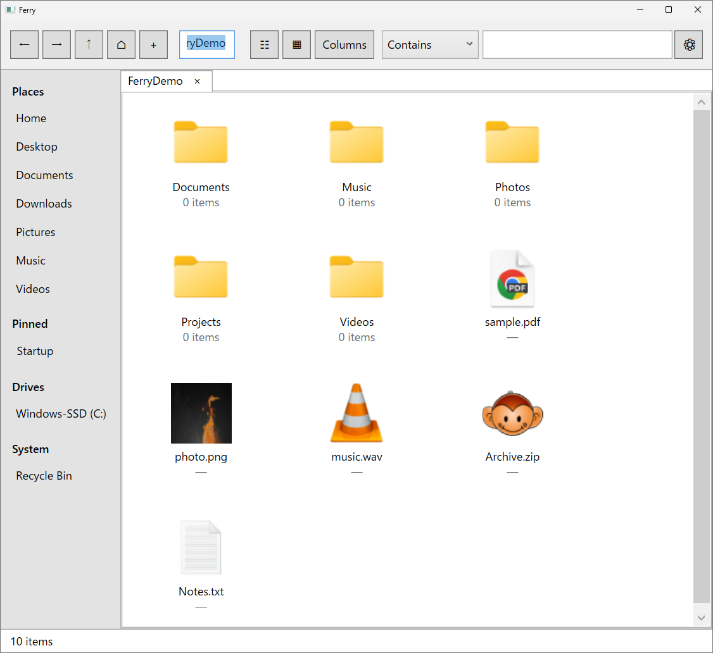
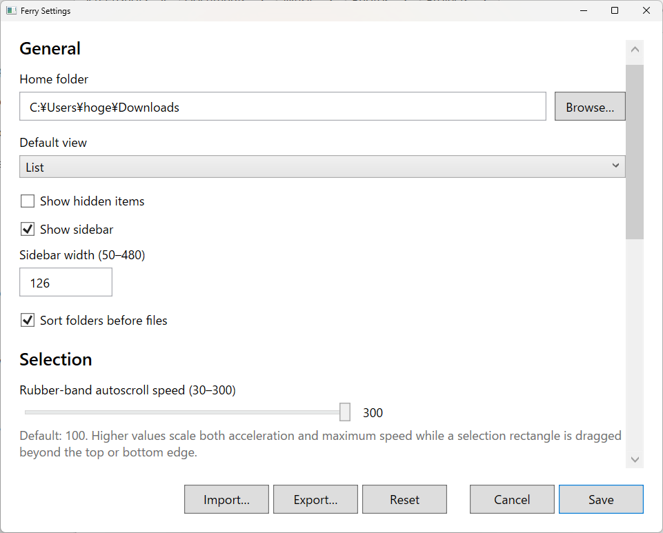
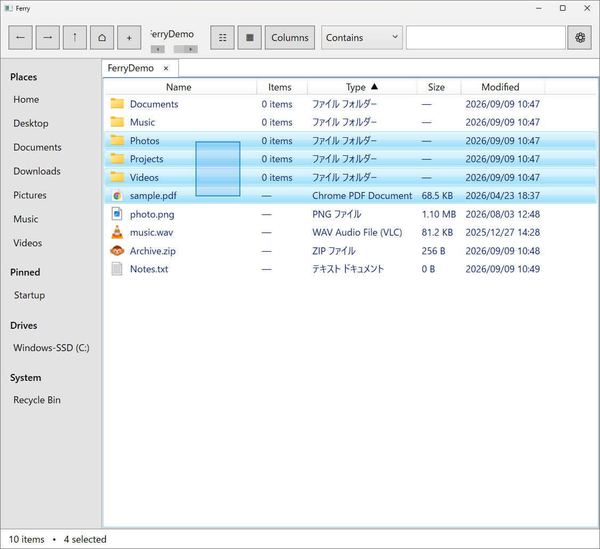
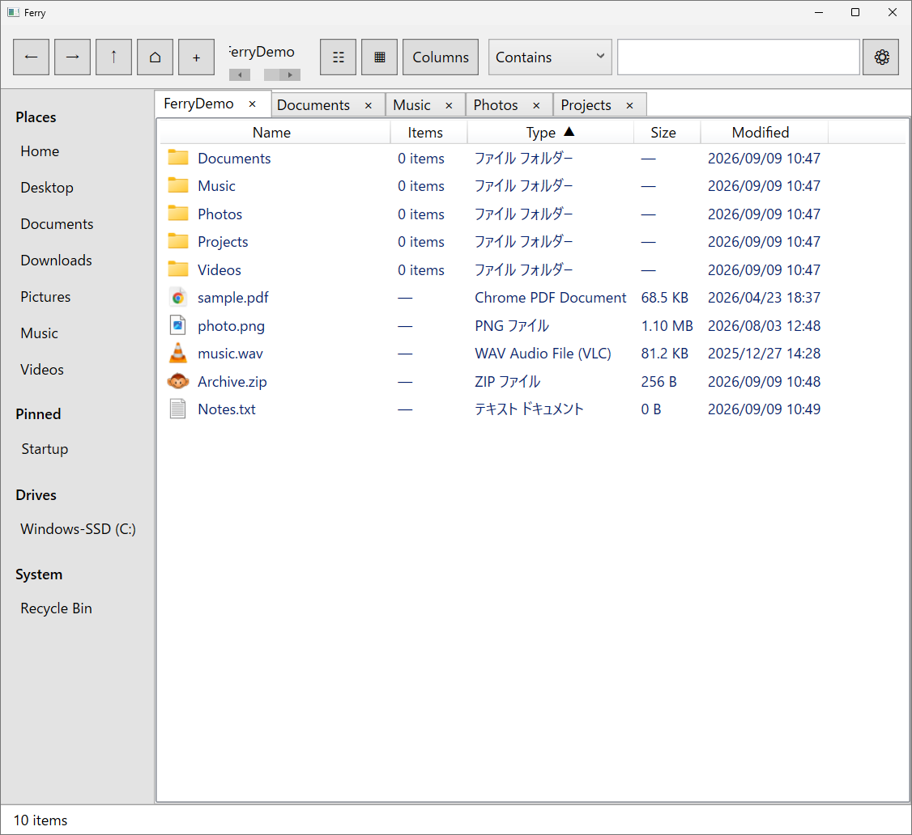
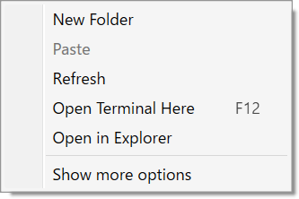
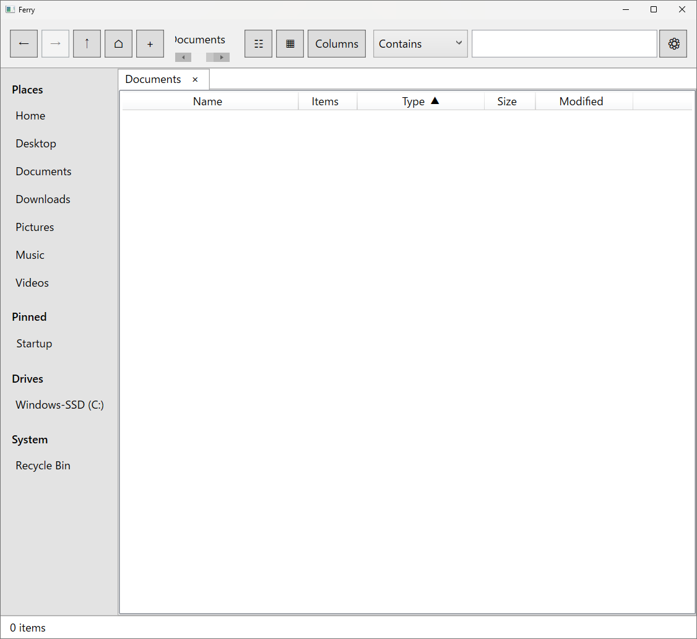

# Ferry

**Nautilusのシンプルさが恋しいWindowsユーザーのための、軽量ファイルマネージャー。**

Ferryは、GNOME Files（Nautilus）の気持ちよいファイル操作体験から着想を得て、Windows 11向けに独立実装したファイルマネージャーです。

LinuxとWindowsを行き来していると、Nautilusの「必要十分で迷わない」操作感が恋しくなることがあります。Ferryは、そのギャップを埋めるために生まれました。

> **現在のリリース:** v1.1.6  
> **対応OS:** Windows 11  
> **Runtime:** .NET Framework 4.8 / WPF  
> **License:** MIT

[English README](README.md)

## ダウンロード

**[Ferry v1.1.6 for Windows をダウンロード（Portable ZIP）](https://github.com/kazu0m1/Ferry/releases/latest/download/Ferry-v1.1.6-win-portable.zip)**

インストールは不要です。ZIPを展開して `Ferry.exe` を実行してください。

> **Windows SmartScreenについて:** Ferryは現在コード署名されていないため、初回起動時にWindowsの警告が表示されることがあります。この公式リポジトリからダウンロードしたFerryであれば、**詳細情報** → **実行** から起動できます。

## スクリーンショット


### Ferryの画面例

| Grid / Location Box | Settings |
|---|---|
|  |  |

| ラバーバンド範囲選択 | タブ |
|---|---|
|  |  |

| コンテキストメニュー | 空フォルダー |
|---|---|
|  |  |

## Ferryが大切にしていること

FerryはExplorerを丸ごと置き換える巨大なファイルマネージャーを目指していません。日常のファイル操作で価値の高い部分に絞っています。

- **Nautilusに着想を得たシンプルな操作感**
- **フォルダー内アイテム数の表示** — Grid/Listの両方で確認可能
- **高速な再帰ファイル名検索** — 結果を逐次表示
- **強力な一括リネーム** — 置換・連番・開始番号指定・ライブプレビュー
- **タブ** — 必要十分なタブブラウジング。ドラッグで並べ替え可能
- **Windowsとの自然な統合** — ごみ箱、プロパティ、詳細Shellメニュー、ショートカット、D&D
- **大容量転送中も応答性を維持** — Windows ShellのCopy/Move中もFerryを最小化・復元でき、タブ切替やフォルダー移動を継続可能。Ferry同士のD&Dでも送受信側の両方を操作可能
- **リムーバブルドライブ対応** — Ferry起動後に接続したドライブを自動反映し、安全な取り外し時は対象タブと監視を解放してから取り外し
- **Portable Device認識** — MTP/Android端末をSidebarに表示し、クリックするとWindows Explorerで開きます
- **Explorer互換のD&D** — FerryからWindows Explorerへの通常Moveで、destinationへ移動したitemがsource側へ残らない
- **Paste結果の可視化** — Copy/Cut → Paste後、今回貼り付けたdestination項目が選択状態で残り、何を貼り付けたかすぐ分かる
- **ZIP圧縮・展開** — Ferry側で進捗・ETA・Cancel・競合処理・安全確認まで管理
- **Portable** — 設定は小さなJSON。独自DBもテレメトリもありません

### 小さいけれど、日常で効く工夫：`F12`

ファイルが画面いっぱいに並ぶと、**Open Terminal Here**のために背景を右クリックできる空白がほとんど残らないことがあります。Ferryでは、その小さな不便を避けるため、選択中のアイテムやキーボードフォーカスの位置に関係なく、**`F12`**を押すだけで現在表示しているフォルダーをTerminalで開けます。

派手な機能ではありませんが、余計なUIを増やさず、日常のファイル操作を直接的で予測しやすくするというFerryの考え方を表す機能のひとつです。

## 起動

### A. GitHub ReleasesのPortable版

1. 上記のダウンロードリンクから`Ferry-v1.1.6-win-portable.zip`をダウンロードします。
2. 好きなフォルダーへ展開します。
3. `Ferry.exe`を実行します。

設定は`Ferry.exe`と同じ場所にある`config`フォルダーへ保存されます。

### B. Source / self-building版

1. Sourceをダウンロードまたはcloneします。
2. `Portable\Run-Ferry.cmd`を実行します。
3. `Ferry.exe`がなければ、`Build.cmd`を呼び出してWindowsに含まれる.NET Framework C#コンパイラでローカルビルドします。
4. Ferryが起動します。

Visual Studio、NuGet、別途.NET SDK、インターネット接続は不要です。

## v1.1.6の初期設定

- Sort folders before files: **ON**（SettingsでOFFに変更可能）
- Home: Windowsのユーザープロファイルフォルダー `%USERPROFILE%`
- View: **List**
- Search: **Contains**
- Terminal: **Auto**
- UI: **English**
- Debug logging: **Off**

TerminalのAutoは次の順に起動を試みます。

1. Windows Terminal
2. Windows PowerShell
3. Command Prompt

MSYS2/UCRT64などを使いたい場合は、Settingsで任意のコマンドと引数を設定できます。公開版には特定PC向けの絶対パスを含めていません。

## 主な機能

### ファイル表示・ナビゲーション

- Home / 標準ユーザーフォルダー / ピン留め / ドライブ / ごみ箱のSidebar。フォルダー項目は右クリックから**Open**、新規タブ/ウィンドウ、Explorer、Properties、Windows詳細メニューを利用可能
- 起動後に接続したリムーバブルドライブを自動表示。安全な取り外し時は対象ドライブを開いている全タブをHome等へ退避してからWindowsへ制御を返す
- MTP / Portable DeviceはSidebarの **Portable Devices** に表示し、クリックするとWindows Explorerで開く
- PinnedはD&Dで並べ替え可能。順序は再起動後も保持
- Sidebar幅は50～480で設定可能。境界をダブルクリックすると表示文字列幅へ自動フィット
- Breadcrumb（`Ctrl+L`でLocation Box、`Esc`または再度`Ctrl+L`でBreadcrumbへ復帰）
- Back / Forward / Up / Home
- Tabs（ドラッグで左右に並べ替え可能）
- List / Grid（Listは軽量なWindows Shell種別アイコン、Gridは内容サムネイル）
- Natural Sort
- Sort folders before files（既定ON）
- 昇順/降順インジケーター
- `Ctrl+Click` / `Shift+Click` / `Ctrl+A`による複数選択
- 複数選択して`Enter`で一括Open
- 選択済みアイテムからD&Dすると選択セット全体をD&D
- 外部から新規追加されたアイテムは末尾に留まり、`F5`やカラムクリックなどユーザーが明示したときに再ソート
- ダウンロード中の`.crdownload`などは位置を動かさずSize/Modifiedを更新
- `F12`で、選択状態に関係なく現在フォルダーにTerminalを開く
- Copy/Cut → Paste後、今回のトップレベルdestination項目を選択状態で残す。次のPasteでは前回結果を引き継がず、今回の結果だけを選択

- Explorerライクなラバーバンド（矩形）範囲選択（List / Grid、Ctrl / Shift / Ctrl+Shift、画面端autoscroll対応）
- Selection Anchorを破線で可視化
- 範囲選択時のautoscroll速度はSettingsで30～300に調整可能（既定100）

### 検索

- 現在フォルダー以下を再帰検索
- ファイル名・フォルダー名を対象
- 非同期・逐次表示
- Contains / StartsWith
- 全角/半角の違いを無視して検索（`カタカナ`で`ｶﾀｶﾅ`もHIT。ひらがな/カタカナは区別）
- `*` / `?` ワイルドカード
- Windows Search Indexを利用できる場合は利用し、不足分は直接走査
- Ferry独自の検索DBは作成しない

### リネーム

単一項目の`F2`では拡張子を含む完全ファイル名を表示し、初期選択はファイル名本体だけにします。

複数項目の`F2`では一括リネーム画面を開きます。

- Find & Replace
- 連番テンプレート
- 開始番号指定
- Current → Newのライブプレビュー
- 現在の表示順に従う連番順序
- 衝突安全な2段階リネーム
- 一括リネームでは拡張子を保護

### ごみ箱

Windows管理のごみ箱をFerry内の仮想ビューとして表示します。

- Restore
- Delete Permanently
- Open Original Location
- Empty Recycle Bin

### Windows連携 / ファイル操作

長時間のCopy/Moveは専用STA workerで実行し、FerryのWPF Dispatcherを塞ぎません。Ferry→FerryのD&Dでは受信側がDropを速やかに受理して制御を返し、その後もWindows Shell transferを継続するため、送受信側の両方を操作できます。

- Copy / Cut / Paste
- Recycle Binへの削除 / 完全削除
- D&D
- Properties
- Open With
- Windows詳細Shellメニュー（複数選択を含む）
- Windowsショートカット
- アイコン / サムネイル

### ZIP

- **Compress to ZIP**
- **Extract Here**
- **Extract to `<archive-name>\`**

FerryはZIP処理のワークフローを自前で管理し、ZIPコンテナ/Deflate処理には.NET標準の`System.IO.Compression`を使用します。Windowsのarchive command-line toolはZIP処理に使用しません。一方で、圧縮アルゴリズムそのものをゼロから自作しているわけではありません。

Start後は設定windowを閉じ、Ferry下部statusへ処理を移します。Ferry本体はそのまま操作でき、グレーのoverall ProgressBar 1本と、処理済み/総量、file count、速度、利用可能な場合はETA、Cancelを表示します。

解凍時の競合処理は次の通りです。

- folder: **MERGE / KEEP BOTH / SKIP / CANCEL**
- file: **REPLACE / KEEP BOTH / SKIP / CANCEL**
- KEEP BOTHは`Folder(1)`、`photo(1).jpg`のような衝突しない名前を生成
- folderをMERGEした後、その配下で最初にfile conflictが起きたときだけ、そのmerged folder配下の残りfile conflictsへ同じ選択を適用可能

解凍前/中には危険なpath/nameをブロックし、各fileは一時fileへ書き終えてから完成名へ確定します。大量リソースを消費する可能性があるZIPは一律拒否せず警告し、ユーザーが続行/中止を選択できます。現在の警告初期値は、展開後20 GiB超、50,000 files超、圧縮率100倍超です。

## Open with FerryをExplorerへ追加

ビルド後に、

```text
ShellIntegration\Register.cmd
```

を実行すると、現在のWindowsユーザーのフォルダーcontext menuに**Open with Ferry**を追加できます。管理者権限は不要です。

解除は、

```text
ShellIntegration\Unregister.cmd
```

です。Explorerの通常のフォルダーOpenを強制的にFerryへ置き換えることはしません。

## 主なキーボードショートカット

| Shortcut | Action |
|---|---|
| `Ctrl+T` | Homeを新しいタブで開く |
| `Ctrl+W` | タブを閉じる |
| `Ctrl+Tab` | 次のタブ |
| `Ctrl+Shift+Tab` | 前のタブ |
| `Alt+Left` | Back |
| `Alt+Right` | Forward |
| `Alt+Up` | Parent folder |
| `Ctrl+L` | パス入力 |
| `Ctrl+F` | Search |
| `F5` | Refreshして現在の条件で再ソート |
| `F12` | 現在フォルダーでOpen Terminal Here |
| `F2` | Rename / bulk rename |
| `Ctrl+C/X/V` | Copy / Cut / Paste |
| `Ctrl+A` | 全選択 |
| `Delete` | ごみ箱へ移動 |
| `Shift+Delete` | 完全削除 |
| `Enter` | 選択中の全アイテムをOpen |
| `Alt+Enter` | Properties |
| `Esc` | Search終了 / 選択解除 |
| `Shift+Right-click` | Windows詳細context menu |

## 設定とプライバシー

設定はSource/self-building構成では`Portable\config\settings.json`、Binary Portable版では`Ferry.exe`と同じ場所の`config\settings.json`に保存します。

`settings.json`が存在しない、またはJSONが壊れている場合でもFerryはfactory defaultで起動します。SettingsをSaveすれば正常なJSONが生成されます。

Ferryには次のものがありません。

- テレメトリ
- 自動クラッシュ送信
- アカウント
- 常駐サービス
- 独自検索DB
- 独自クラウド同期

Windowsが既に優れた機能を持つ領域は、Ferryで再実装せずWindowsへ委譲することを基本方針としています。Settingsには実行中のVersion、`Created by kazu0m1`、GitHub、MIT Licenseを確認できる**About Ferry**もあります。

## GNOME / Nautilusとの関係

FerryはGNOME Files（Nautilus）のUXから着想を得た**独立したWindowsアプリケーション**です。Nautilusの移植・fork・改変版ではなく、NautilusのソースコードやGNOMEのアートワークを含みません。

GNOME®はGNOME Foundationの登録商標です。FerryはGNOME Foundationとの提携・承認・支援関係にありません。

## Build

```text
Build.cmd
```

GitHub Releases向けのBinary Portable ZIPを作る場合はWindowsで、

```text
Make-PortableRelease.cmd
```

を実行します。生成物は、

```text
dist\Ferry-v1.1.6-win-portable.zip
```

です。

## 仕様書

現行v1.1の差分仕様は`Ferry_SPEC_v1.1.md`、歴史的なv1.0/v1.0.2ベースラインは`Ferry_SPEC_v1.0.md`を参照してください。詳細な矩形選択仕様は`docs/RUBBER_BAND_SELECTION_SPEC_JA.md`に凍結しています。

## License

MIT License。`LICENSE.txt`を参照してください。

Copyright © 2026 **kazu0m1**.
